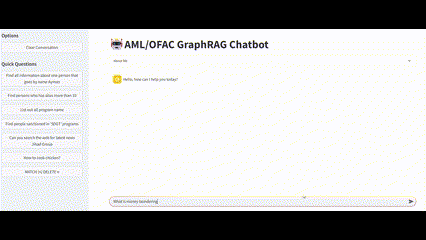
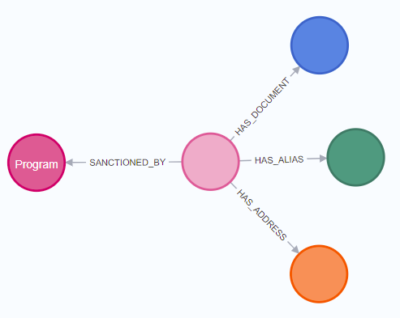

# Build a AML/OFAC GraphRag ChatBot with OpenAI, Neo4j and LangGraph



## Description

This is a repository for a Chatbot backed by neo4j graph database. Recommended pre-requisite knowledge can be found [here](https://github.com/swatakit/llm-graph-chatbot).

## 1. Install Neo4j Desktop

[Download](https://neo4j.com/download/)

## 2. Setup python env
```bash
conda create --name neo4j-graphrag python=3.12.4 -y
activate neo4j-graphrag
pip install -r requirements.txt
```

Then install the latest langchain community/experimental and other packages
```bash
pip install langchain_community
pip install langchain-experimental
pip install langchain_neo4j
pip install neo4j
pip install pyvis
pip install py2neo
pip install streamlit
```

## 3. Setup Neo4j OFAC Graph Database


Please follow the instruction in [Convert JSON to GraphDocument and insert into Neo4j](notebook/04_neo4j_build_graph_llmtransformer_custom_prompt.ipynb) to create a graph database. Once completed, you will have the schema as below. 



## 4. Start streamlit app

Pre-requisites: create`.env` at root folder. Below is the exameple content :

```bash
OPENAI_API_KEY="sk-proj-...ZAA"
TAVILY_API_KEY="tvly-...UIj"

NEO4J_URI="bolt://localhost:7687"
NEO4J_USER="neo4j"
NEO4J_PASSWORD="<password>"
```

Optional environment variables:
```bash
LANGCHAIN_API_KEY="lsv2_..85"
LANGCHAIN_TRACING_V2=true
LANGCHAIN_ENDPOINT="https://api.smith.langchain.com"
LANGSMITH_PROJECT="langgraph-aml"
```

Ensure that Neo4j has started, then start the app on [http://localhost:8501/](http://localhost:8501/)

```bash
streamlit run app.py
```

## Useful Cypher Commands

Please refer to this [script](script/saved-scripts-2025-02-05.cypher)